# Milestone 1 Project
Project saya dalam milestone ini membuat company profile dari tempat saya bekerja,yaitu BFI Finance dan menggunakan beberapa hal yang sudah dipelajari dari week 1 - 4. Berikut hasil dari pengerjaan saya selama 4 hari.
Link :https://allabouthokkaido.site/
*karna keterlambatan dalam membeli costum domain jadi menggunakan costum domain yang ada terlebih dahulu,jika costum domain sudah bisa digunakan akan diganti.

## Proses dalam mengerjakan project ini
1. untuk mendukung dalam menjalankan project menggunakan beberapa command dari git, untuk clone repositories dan membuat project baru, seperti beberapa command dibawah ini, dan membuat basicnya di HTML, kemudian mendesainnya menggunakan css tetapi masih basic karena belum banyak explore.
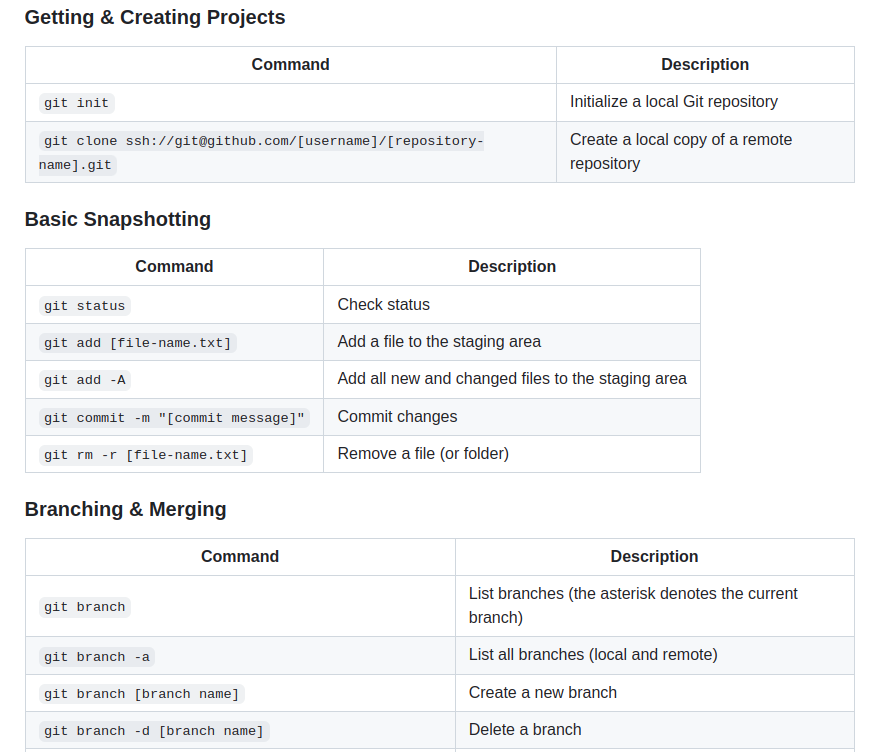
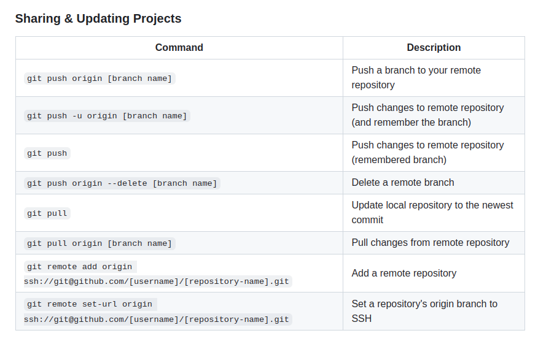
2. setelah selesai dalam membuat HTML dan CSS hal yang perlu dilakukan selanjutnya adalah dengan mendeploy project dengan bantuan netlify,pertama membuka website netlify dan melakukan login menggunakan akun github agar dapat dilakukan konektivitas antara web dan dapat auto deploy jika melakukan perubahan di HTML/CSS yang di push direpository yang terhubung ke netlify.
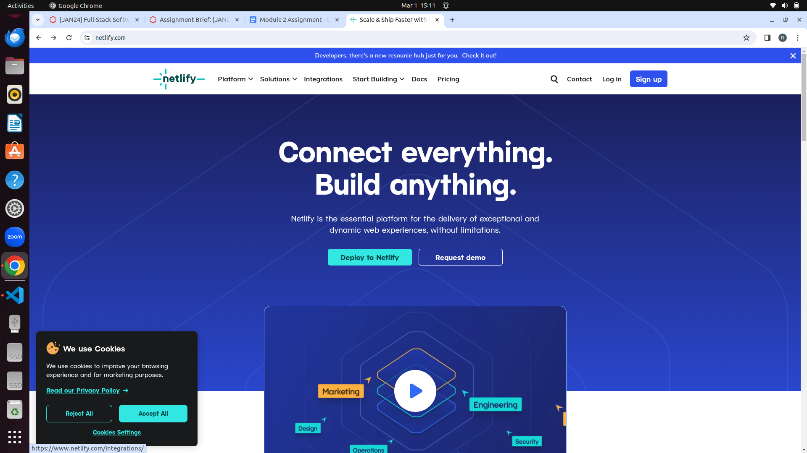
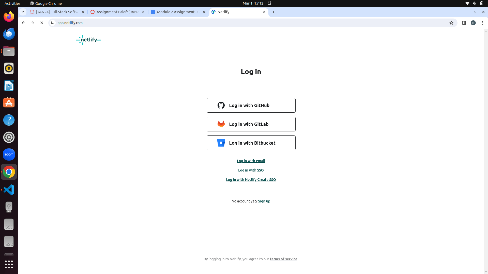
3. berikut tampilan setelah login,kemudian setelah login bisa pilih menu add newsite import existing project
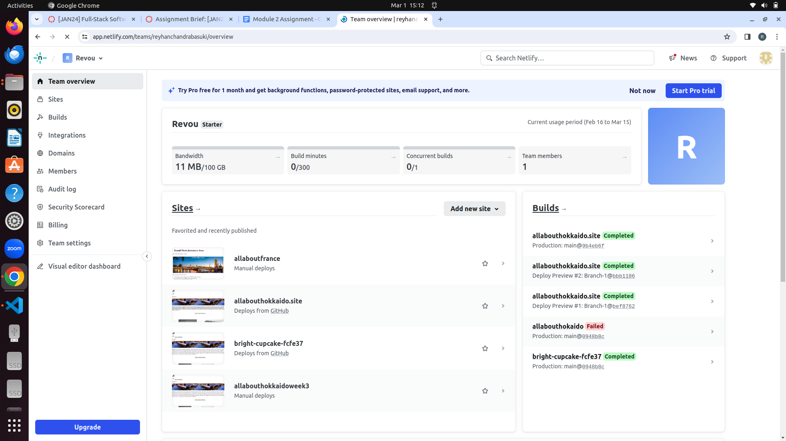
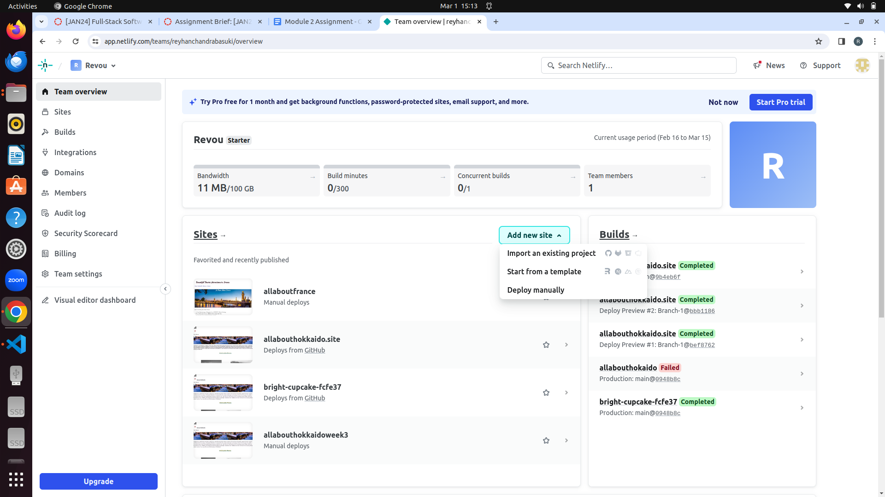
4. Lalu pilih melakukan deploy menggunakan githubb
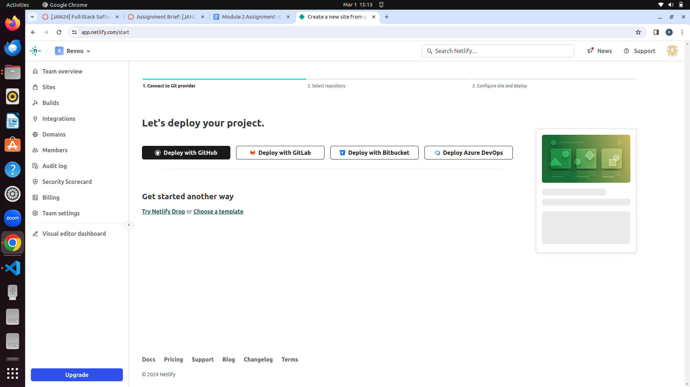
5. Setelah memilih deploy menggunakan github maka akan ditampilkan repositories yang tersedia di github yang kita miliki, kemudian pilih repositories
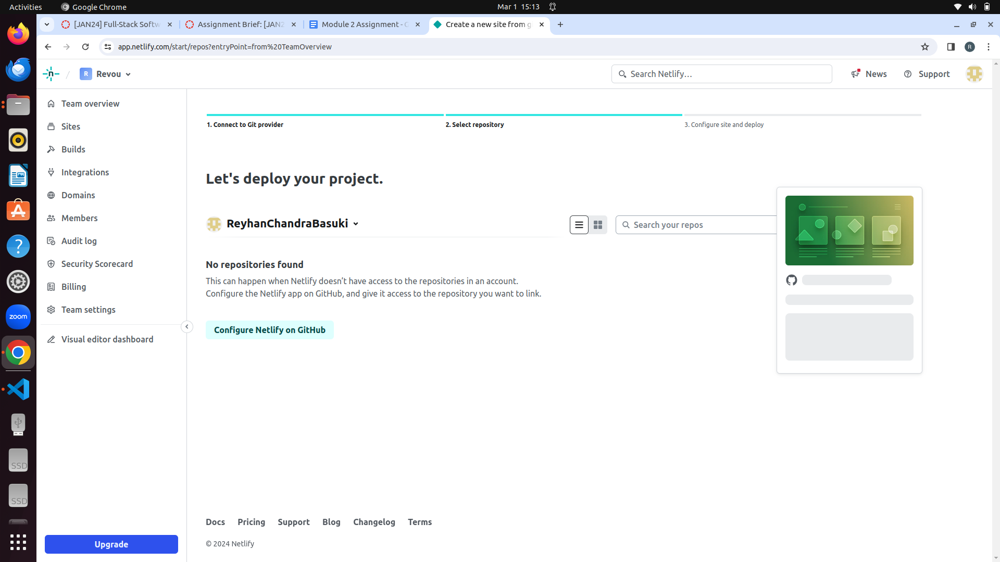
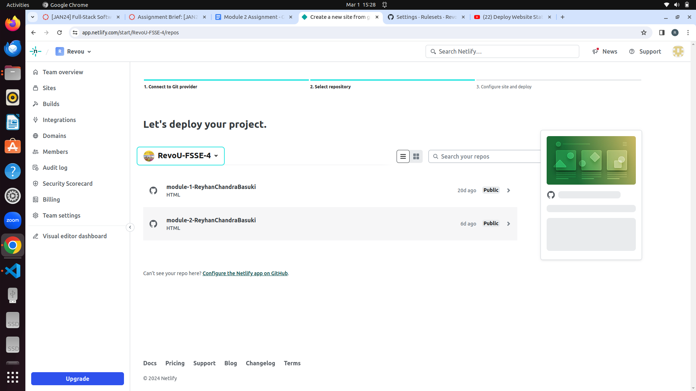
6. Maka dari netlify akan melakukan build up website kita,proses memakan waktu sekitar beberapa menit
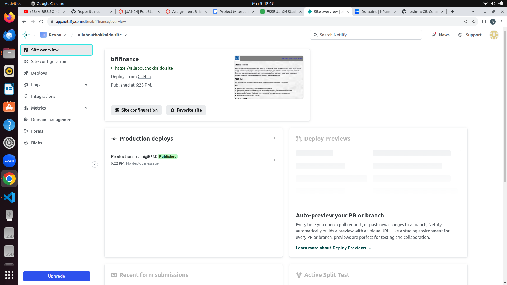
7. Setelah melakukan deploy di netlify,langkah selanjutnya adalah membuka website niagahoster dan melakukan login menggunakan email atau facebook
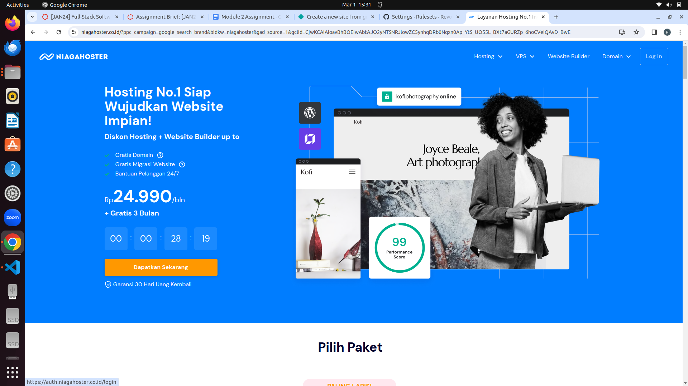
8. Kemudian masukan nama dari domain yang akan kita gunakan,dan memilih domain apa yang akan kita gunakan, disini saya menggunakan domain .site
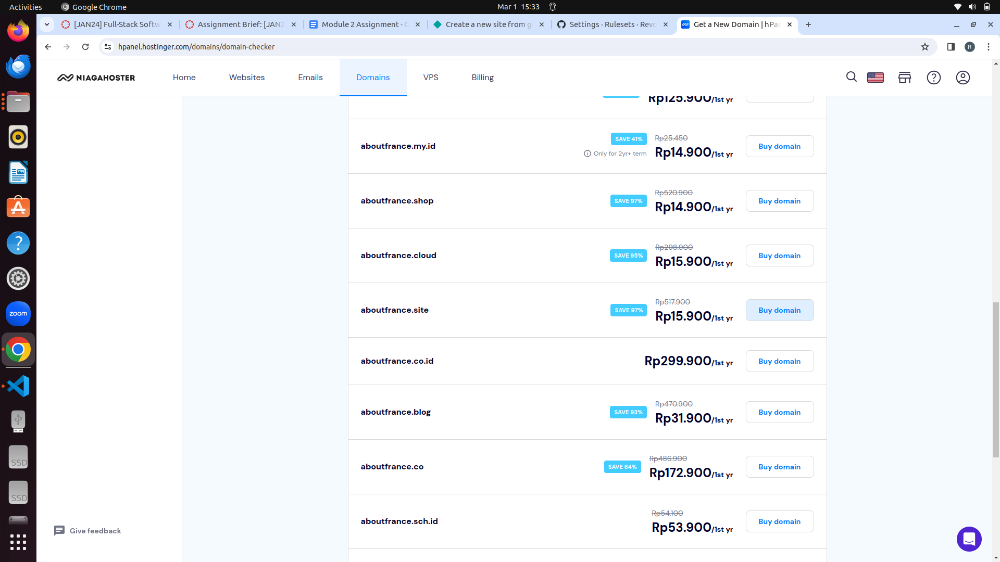
9. Setelah memilih domain yang akan digunakan selanjutnya adalah melakukan pembayaran agar domain yang kita pilih bisa digunakan
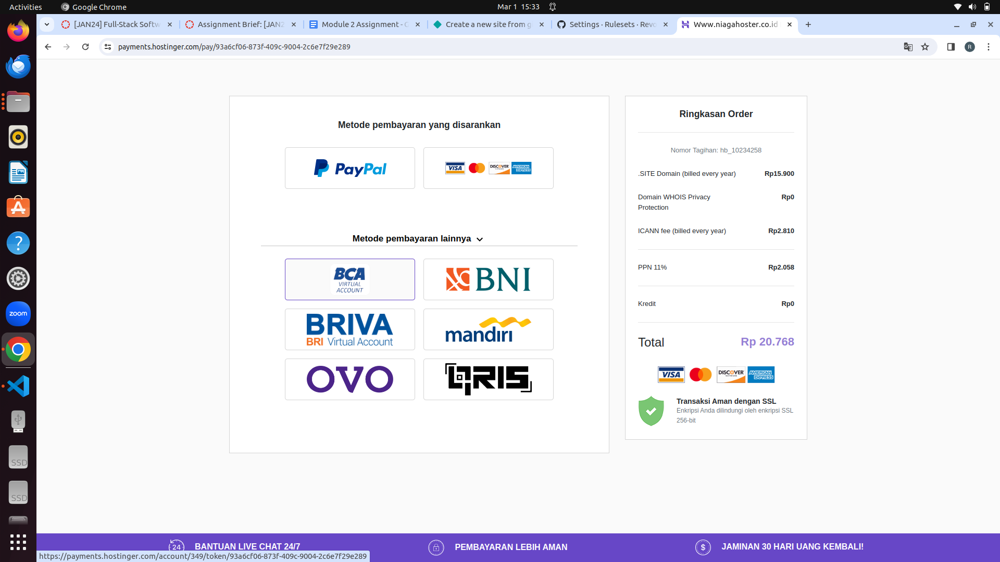
10. Setelah domain berhasil dibeli maka langkah selanjutnya adalah melakukan penyetingan nameserver, yang dimana dilihat dari netlify project yang sudah dideploy, setelah itu dimasukan ke web kita membeli domain agar domain tersebut terhubung dengan project yang dimiliki
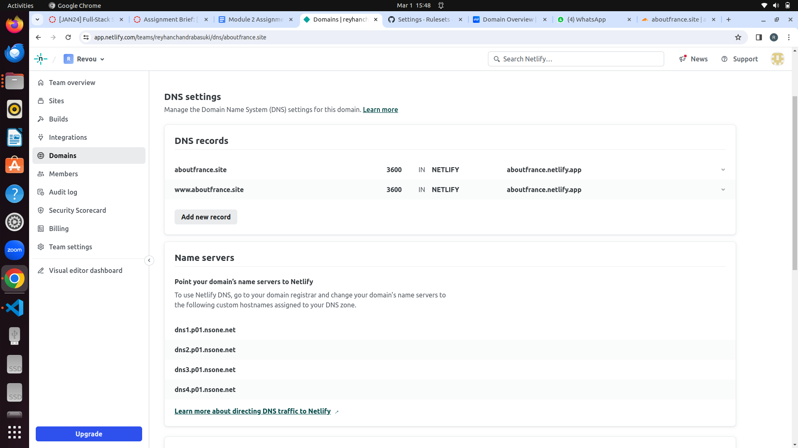
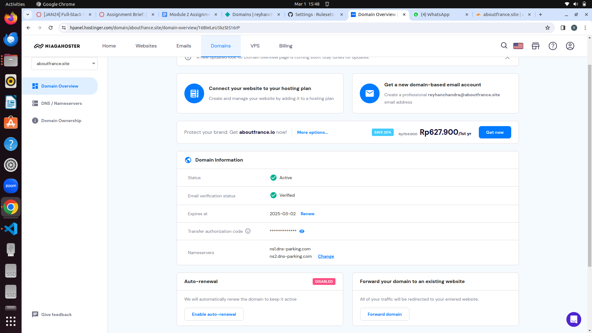
11. Karena keterlambatan membeli domain maka harus menunggu 24 jam agar domain bisa digunakan jadi alternatif yang dilakukan adalah menggunakan domain lain telebih dahulu
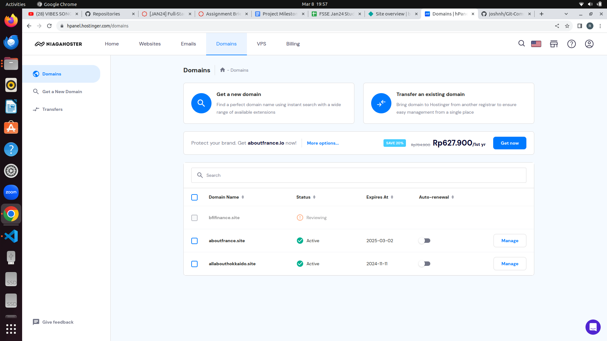

